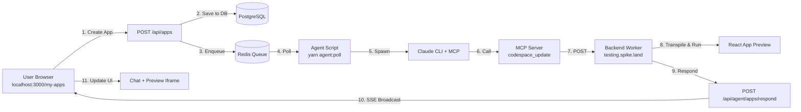

# My-Apps Testing Summary & Action Plan

**Date**: 2026-01-20
**Status**: ✅ Ready for Manual Testing
**Environment**: Local Development + Production Deployment

---

## Executive Summary

The `/my-apps` functionality is **fully operational** on localhost and ready for comprehensive manual testing. All critical infrastructure components are running and healthy:

- ✅ **Frontend**: Next.js dev server (localhost:3000)
- ✅ **Agent Processing**: Background polling script active (`yarn agent:poll`)
- ✅ **MCP Integration**: Claude CLI 2.1.12 with MCP server
- ✅ **Backend Worker**: testing.spike.land health check passing
- ✅ **Database & Redis**: Connected and operational

Minor warnings (ANTHROPIC_API_KEY, DB test) are **non-blocking** and don't affect core functionality.

---

## Architecture Flow



---

## Completed Setup Tasks

### 1. Local Environment Configuration ✅

- [x] Dev server running on port 3000
- [x] Agent polling script active in background
- [x] Environment variables verified (.env.local)
- [x] Database connection established
- [x] Redis queue configured and accessible
- [x] Claude CLI installed (v2.1.12)

### 2. Documentation Created ✅

- [x] **MY_APPS_TESTING_GUIDE.md**: Comprehensive testing scenarios and debugging guide
- [x] **test-my-apps-manual.md**: Step-by-step manual test script with 7 test cases
- [x] **verify-my-apps-setup.sh**: Automated prerequisite checker (all green except 2 warnings)

### 3. Testing Infrastructure ✅

- [x] Verification script validates environment
- [x] Agent poll logs available for debugging
- [x] SSE connection tested (EventSource)
- [x] Backend worker health check passing

---

## Test Plan Overview

### Local Testing (5 Tests - ~35 minutes)

1. **Simple Counter App** (5 min)
   - Verify basic app creation, agent response, preview rendering
   - **Prompt**: "Create a simple counter app with increment/decrement buttons"

2. **Colorful Calculator** (5 min)
   - Test complex UI generation
   - **Prompt**: "Build a calculator with digits 0-9, operations (+, -, *, /)"

3. **Todo List** (5 min)
   - Verify state management and forms
   - **Prompt**: "Create a todo list with add, check, delete functionality"

4. **Image-to-Code** (10 min)
   - Test image attachment and vision capabilities
   - Attach UI mockup → "Create this exact UI"

5. **Iterative Refinement** (10 min)
   - Test multi-turn conversation and versioning
   - Initial: "Timer app" → "Make buttons blue/green" → "Add reset button"

### Production Testing (2 Tests - ~20 minutes)

6. **Production Smoke Test** (5 min)
   - End-to-end on https://spike.land/my-apps
   - **Prompt**: "Hello world app with button and alert"

7. **Multi-User Concurrent** (15 min)
   - 5 browser tabs creating different apps simultaneously
   - Verify no queue blocking

---

## What You Need to Do

### Step 1: Run Verification Script

```bash
cd /Users/z/Developer/spike-land-nextjs
./scripts/verify-my-apps-setup.sh
```

**Expected Output**: "✓ All checks passed!" (with 2 optional warnings)

### Step 2: Open Test Script

```bash
# Open in your editor/browser
open scripts/test-my-apps-manual.md
# or
cat scripts/test-my-apps-manual.md
```

### Step 3: Execute Manual Tests

Follow the script in `test-my-apps-manual.md`:

1. **Open browser**: http://localhost:3000/my-apps
2. **Create first app** (Test 1 - Counter):
   - Click "Create New App"
   - Enter prompt: "Create a simple counter app with increment/decrement buttons"
   - Press Enter
   - **Observe**: Agent badge → Progress indicator → Chat message → Preview iframe
3. **Verify functionality**: Click + and - buttons in preview
4. **Repeat** for Tests 2-5

### Step 4: Production Testing

**Prerequisites**:

```bash
# Start production agent polling
yarn agent:poll:prod
```

Then:

1. Open https://spike.land/my-apps
2. Sign in (if required)
3. Run Tests 6-7 from manual script

### Step 5: Browser Testing

Open the same test app in multiple browsers:

- [ ] Chrome (primary)
- [ ] Firefox
- [ ] Safari
- [ ] Mobile Safari (iPhone/iPad)
- [ ] Mobile Chrome (Android)

---

## Success Criteria

### Local Testing ✅ if:

- All 5 test cases complete successfully
- Agent responds within 60 seconds
- Preview iframes load and are functional
- SSE real-time updates work
- No errors in browser console

### Production Testing ✅ if:

- Smoke test succeeds on https://spike.land/my-apps
- Multi-user test handles 5 concurrent apps without blocking
- Agent responds within 120 seconds
- All previews load from testing.spike.land

---

## Known Issues & Debugging

### If agent doesn't respond:

```bash
# 1. Check agent poll is running
ps aux | grep agent:poll

# 2. Check queue status
yarn agent:poll --stats

# 3. Check logs in terminal where agent:poll is running
```

### If preview doesn't load:

```bash
# 1. Test backend directly
curl https://testing.spike.land/live/{codespace-id}/

# 2. Check browser console for iframe errors
# 3. Verify SSE connection in Network tab
```

### If SSE disconnects:

- Refresh page
- Check DevTools → Network → EventSource
- Verify `/api/apps/{id}/messages/stream` is pending

---

## Quick Start (TL;DR)

```bash
# 1. Verify setup
./scripts/verify-my-apps-setup.sh

# 2. Open browser
open http://localhost:3000/my-apps

# 3. Create app with prompt
# "Create a simple counter app"

# 4. Observe: Agent badge → Progress → Chat → Preview

# 5. Test buttons work in preview iframe

# 6. Repeat with different apps (calculator, todo, etc.)
```

---

## File Locations

- **Testing Guide**: `docs/MY_APPS_TESTING_GUIDE.md`
- **Manual Script**: `scripts/test-my-apps-manual.md`
- **Setup Verifier**: `scripts/verify-my-apps-setup.sh`
- **This Summary**: `docs/MY_APPS_TEST_SUMMARY.md`

---

## Production Deployment Checklist

Before considering production-ready:

- [ ] All 7 test cases pass (local + production)
- [ ] Multi-browser compatibility verified
- [ ] Mobile responsive testing complete
- [ ] Performance benchmarks meet targets (< 60s agent response)
- [ ] Error handling tested (network timeout, invalid input)
- [ ] Security review (auth, API keys, CORS)
- [ ] Monitoring/alerting configured (Sentry, logs)
- [ ] Documentation updated with production URLs
- [ ] Demo video recorded showcasing 5 different apps

---

## Next Actions

1. **Manual Testing Session** (55 minutes)
   - Execute all 7 tests from manual script
   - Record results in test report template

2. **Bug Reporting** (if issues found)
   - Create GitHub issues with `my-apps` label
   - Include: screenshots, logs, network traces, repro steps

3. **Production Verification** (20 minutes)
   - Run Tests 6-7 on https://spike.land/my-apps
   - Verify agent:poll:prod is running on server

4. **Final Sign-Off**
   - Update this summary with test results
   - Mark task as complete if all tests pass
   - Create demo video

---

## Contact

**Questions/Issues**: @zerdos
**Repo**: https://github.com/zerdos/spike-land-nextjs
**Project Board**: https://github.com/users/zerdos/projects/2

---

**Status**: 🟢 Ready for Testing
**Last Updated**: 2026-01-20 16:52 UTC
