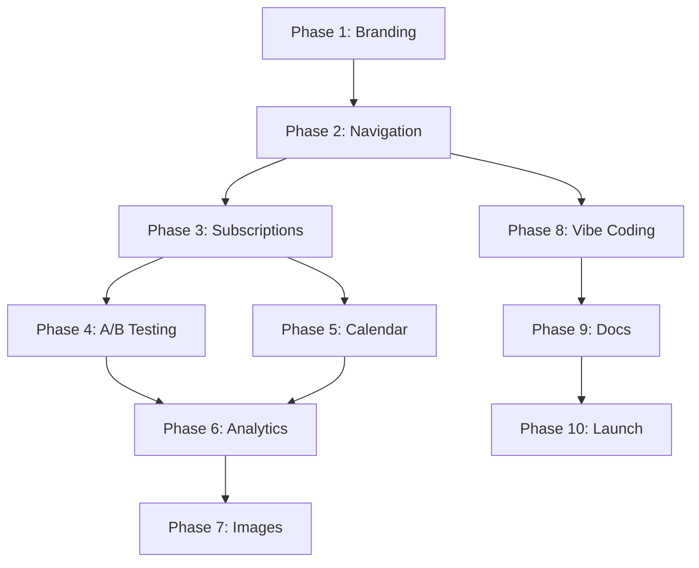

# Implementation Plan: Epic #836 - Spike Land Pivot to AI-Powered Social Media Command Center

**Issue**: #836
**Type**: Epic (10 Child Issues)
**Timeline**: 3+ months
**Status**: Phase 1 Complete, Phases 2-10 Pending

## Executive Summary

This plan outlines the complete transformation of Spike Land from a "vibe coding" focused platform to an AI-powered social media command center with Orbit as the flagship product. The codebase already has extensive Orbit infrastructure including workspaces, social integrations, Brand Brain, calendar, A/B testing, and more.

### Key Changes

| Aspect                | From                               | To                                       |
| --------------------- | ---------------------------------- | ---------------------------------------- |
| **Primary Product**   | Vibe coding apps                   | Orbit social media management            |
| **Secondary Product** | N/A                                | Vibe coding (campaign tools)             |
| **Target Audience**   | Developers                         | Content creators, SMMs, small businesses |
| **Monetization**      | Token-based                        | Subscription tiers (Free/$29/$99)        |
| **Platform Tagline**  | "Vibe Coded Apps with Claude Code" | "AI-Powered Social Media Command Center" |

## Phase Breakdown

### ✅ Phase 1: Brand Repositioning (Complete) - Issue #837

**Evidence of Completion:**

- Homepage (`src/app/page.tsx`) already showcases Orbit
- Orbit landing components exist (`src/components/orbit-landing/`)
- Extensive Orbit infrastructure in place

**Verification Needed:**

- Confirm all marketing materials updated
- Verify meta tags and SEO updated
- Check social media profiles reflect new branding

---

### 🔄 Phase 2: Navigation Restructure (Week 2-3) - Issue #838

**Objective**: Make Orbit the primary navigation focus, demote "My Apps" to secondary.

#### Current Navigation Analysis

**Main App Navigation** (`src/app/layout.tsx`):

- Likely contains global navigation bar
- My Apps probably featured prominently

**Orbit Navigation** (`src/app/orbit/[workspaceSlug]/OrbitSidebar.tsx`):

- Already exists with workspace-specific navigation
- Contains links to dashboard, calendar, streams, etc.

#### Implementation Tasks

**1. Update Root Layout Navigation** (`src/app/layout.tsx`)

Priority navigation order should be:

```
Primary:
  - Orbit (dashboard / workspace selector)
  - Pricing (subscription tiers)

Secondary:
  - My Apps (renamed to "Build Custom Tools")
  - Resources / Docs
```

**Files to Modify:**

- `src/app/layout.tsx` - Main navigation component
- `src/components/navigation/` - Navigation components (if they exist)
- `src/app/orbit/page.tsx` - Workspace selection page (may need enhancement)

**2. Create Workspace Onboarding Flow**

New users should land in workspace creation flow:

```
/orbit
  └─ If no workspaces: Show workspace creation wizard
  └─ If workspaces exist: Show workspace selector
      └─ /orbit/[workspaceSlug]/dashboard
```

**Files to Create:**

- `src/app/orbit/onboarding/page.tsx` - Workspace creation wizard
- `src/components/orbit/workspace-wizard.tsx` - Wizard component

**3. Update Authentication Flow**

Post-login redirect should go to Orbit:

**Files to Modify:**

- `src/auth.ts` - Update redirect logic
- `src/app/auth/signin/page.tsx` - Update redirect after sign-in

#### Database Changes

**None required** - Workspace model already exists in schema.

#### Testing Requirements

- E2E test for workspace creation flow
- E2E test for navigation accessibility from all pages
- Unit tests for navigation component changes

---

### 🔄 Phase 3: Subscription Implementation (Week 3-4) - Issue #839

**Objective**: Replace token-based pricing with workspace subscription tiers.

#### Current State Analysis

**Existing Infrastructure:**

- `docs/SUBSCRIPTION_TIERS.md` already documents the system
- Workspace model has subscription fields in `prisma/schema.prisma`
- `src/lib/subscription/` likely contains implementation
- Stripe integration exists (`src/app/api/stripe/`)

#### Implementation Tasks

**1. Verify Database Schema**

Check `Workspace` model has all required fields:

```prisma
model Workspace {
  subscriptionTier     WorkspaceSubscriptionTier @default(FREE)
  maxSocialAccounts    Int     @default(3)
  maxScheduledPosts    Int     @default(30)
  maxAbTests           Int     @default(1)
  monthlyAiCredits     Int     @default(100)
  usedAiCredits        Int     @default(0)
  maxTeamMembers       Int     @default(1)
  billingCycleStart    DateTime?
  stripeSubscriptionId String? @unique
}
```

**Files to Check/Modify:**

- `prisma/schema.prisma`
- Run migration if fields missing: `yarn db:migrate`

**2. Implement Subscription Service**

Ensure `WorkspaceSubscriptionService` is complete:

**Files to Check/Create:**

- `src/lib/subscription/workspace-subscription.ts` - Core service
- `src/lib/subscription/tier-config.ts` - Tier definitions
- `src/lib/subscription/index.ts` - Exports

**Required Methods:**

```typescript
class WorkspaceSubscriptionService {
  static canAddSocialAccount(workspaceId: string);
  static canSchedulePost(workspaceId: string);
  static canCreateAbTest(workspaceId: string);
  static consumeAiCredits(workspaceId: string, amount: number);
  static upgradeTier(workspaceId: string, tier: WorkspaceSubscriptionTier);
  static downgradeTier(workspaceId: string, tier: WorkspaceSubscriptionTier);
}
```

**3. Create Pricing Page**

**Files to Create/Modify:**

- `src/app/pricing/page.tsx` - Already exists, verify displays subscription tiers
- `src/components/pricing/tier-comparison.tsx` - Comparison table
- `src/components/pricing/upgrade-cta.tsx` - Upgrade prompts

**4. Implement Stripe Checkout**

**Files to Create/Modify:**

- `src/app/api/subscriptions/checkout/route.ts` - Create checkout session
- `src/app/api/webhooks/stripe/route.ts` - Handle subscription events
- `src/app/orbit/[workspaceSlug]/settings/billing/page.tsx` - Billing management

**Stripe Events to Handle:**

- `customer.subscription.created`
- `customer.subscription.updated`
- `customer.subscription.deleted`
- `invoice.payment_succeeded`
- `invoice.payment_failed`

**5. Implement Limit Enforcement**

Add limit checks to all gated features:

**Files to Modify:**

- `src/app/api/orbit/[workspaceSlug]/accounts/route.ts` - Social account creation
- `src/app/api/orbit/[workspaceSlug]/posts/schedule/route.ts` - Post scheduling (if exists)
- `src/app/api/orbit/[workspaceSlug]/ab-tests/route.ts` - A/B test creation
- `src/app/api/orbit/[workspaceSlug]/*/route.ts` - Any AI-powered features

**6. Create Upgrade Prompts**

**Files to Create:**

- `src/components/orbit/upgrade-prompt.tsx` - Modal/banner for upgrade
- `src/hooks/useSubscriptionLimit.ts` - Hook to check limits

**7. Implement Credit Reset Cron**

**Files to Create:**

- `src/app/api/cron/reset-workspace-credits/route.ts` - Monthly credit reset
- Vercel cron config in `vercel.json`

#### Testing Requirements

- Unit tests for subscription service (100% coverage)
- Unit tests for limit enforcement
- E2E test for upgrade flow
- E2E test for limit prompts
- Stripe webhook testing (use Stripe CLI)

---

### 🔄 Phase 4: A/B Testing for Social Posts (Week 4-6) - Issue #840

**Objective**: Implement A/B testing functionality for social media posts.

#### Current State Analysis

**Existing Code:**

- `src/app/orbit/[workspaceSlug]/ab-tests/page.tsx` - Already exists!
- `src/components/orbit/ab-tests/` - Components exist
- `src/app/api/orbit/[workspaceSlug]/ab-tests/` - API routes exist
- `prisma/schema.prisma` - Likely has ABTest model

#### Implementation Tasks

**1. Verify Database Schema**

Check for ABTest models:

```prisma
model ABTest {
  id              String        @id @default(cuid())
  workspaceId     String
  name            String
  status          ABTestStatus  // DRAFT, ACTIVE, COMPLETED, CANCELLED
  variations      ABTestVariation[]
  metrics         Json          // engagement, clicks, shares, etc.
  winner          String?       // ID of winning variation
  endDate         DateTime?
}

model ABTestVariation {
  id          String   @id @default(cuid())
  abTestId    String
  content     String   @db.Text
  imageUrl    String?
  metrics     Json     // impressions, engagement, CTR
  isControl   Boolean  @default(false)
}
```

**Files to Check:**

- `prisma/schema.prisma`

**2. Enhance UI Components**

**Files to Review/Enhance:**

- `src/components/orbit/ab-tests/CreateAbTestDialog.tsx`
- `src/components/orbit/ab-tests/AbTestsList.tsx`
- `src/components/orbit/ab-tests/AbTestStatistics.tsx`

**3. Implement AI Variation Generation**

**Files to Create/Modify:**

- `src/app/api/orbit/[workspaceSlug]/ab-tests/generate-variations/route.ts` - Already exists!
- Connect to Brand Brain for consistent voice

**4. Implement Statistical Analysis**

**Files to Create:**

- `src/lib/ab-testing/statistical-analysis.ts` - Chi-square, confidence intervals
- `src/lib/ab-testing/winner-detection.ts` - Auto-detect winning variation

**5. Enforce Subscription Limits**

Add limit check to A/B test creation:

**Files to Modify:**

- `src/app/api/orbit/[workspaceSlug]/ab-tests/route.ts` - Add subscription check

#### Testing Requirements

- Unit tests for statistical analysis
- Unit tests for winner detection
- E2E test for A/B test creation flow
- E2E test for variation generation
- E2E test for winner selection

---

### 🔄 Phase 5: AI Content Calendar (Week 6-8) - Issue #841

**Objective**: Implement AI-powered content calendar with scheduling.

#### Current State Analysis

**Existing Code:**

- `src/app/orbit/[workspaceSlug]/calendar/page.tsx` - Exists
- `src/app/orbit/[workspaceSlug]/calendar/CalendarClient.tsx` - Exists
- `src/components/calendar/` - Calendar components exist
- `src/app/api/orbit/[workspaceSlug]/calendar/` - API routes exist

#### Implementation Tasks

**1. Verify Database Schema**

Check for calendar models:

```prisma
model ScheduledPost {
  id                String              @id @default(cuid())
  workspaceId       String
  userId            String
  content           String              @db.Text
  scheduledFor      DateTime
  status            ScheduledPostStatus // DRAFT, SCHEDULED, PUBLISHED, FAILED
  platforms         String[]            // ["twitter", "linkedin", "facebook"]
  aiGenerated       Boolean             @default(false)
  aiPrompt          String?             @db.Text
  publishedIds      Json?               // Platform-specific post IDs
}

model ContentCalendarRecommendation {
  id              String   @id @default(cuid())
  workspaceId     String
  recommendedDate DateTime
  postType        String   // "product_launch", "engagement", "thought_leadership"
  reasoning       String   @db.Text
  aiGenerated     Boolean  @default(true)
}
```

**Files to Check:**

- `prisma/schema.prisma`

**2. Implement AI Content Generation**

**Files to Review/Create:**

- `src/app/api/orbit/[workspaceSlug]/calendar/generate-content/route.ts` - Exists!
- `src/app/api/orbit/[workspaceSlug]/calendar/recommendations/route.ts` - Exists!
- `src/app/api/orbit/[workspaceSlug]/calendar/optimal-times/route.ts` - Exists!

**3. Enhance Calendar UI**

**Files to Review/Enhance:**

- `src/app/orbit/[workspaceSlug]/calendar/CalendarClient.tsx`
- `src/components/calendar/WeeklyPlanGenerator.tsx` - Exists!
- `src/components/calendar/AITimeOptimizer.tsx` - Exists!

**4. Implement Post Scheduling Logic**

**Files to Create/Modify:**

- `src/lib/calendar/scheduler.ts` - Post scheduling service
- `src/app/api/cron/publish-scheduled-posts/route.ts` - Cron job for publishing

**5. Integrate with Social Platforms**

**Files to Modify:**

- `src/lib/social/twitter-api.ts` - Twitter posting
- `src/lib/social/linkedin-api.ts` - LinkedIn posting
- `src/lib/social/facebook-api.ts` - Facebook posting

**6. Enforce Subscription Limits**

**Files to Modify:**

- `src/app/api/orbit/[workspaceSlug]/calendar/schedule/route.ts` - Add limit check

#### Testing Requirements

- Unit tests for scheduling logic
- Unit tests for AI recommendations
- E2E test for post scheduling
- E2E test for calendar UI
- E2E test for AI content generation

---

### 🔄 Phase 6: Analytics Dashboard (Week 8-10) - Issue #842

**Objective**: Create comprehensive analytics dashboard with AI insights.

#### Implementation Tasks

**1. Create Database Models**

**Files to Modify:**

- `prisma/schema.prisma` - Add AIInsight model:

```prisma
model AIInsight {
  id              String      @id @default(cuid())
  workspaceId     String
  type            InsightType // OPPORTUNITY, WARNING, ACHIEVEMENT, TREND
  title           String
  description     String      @db.Text
  recommendation  String?     @db.Text
  metrics         Json
  confidence      Float       // 0.0 to 1.0
  isRead          Boolean     @default(false)
  createdAt       DateTime    @default(now())

  workspace       Workspace   @relation(fields: [workspaceId], references: [id])
}

enum InsightType {
  OPPORTUNITY
  WARNING
  ACHIEVEMENT
  TREND
}
```

**2. Create Analytics Components**

**Files to Create:**

```
src/components/orbit/analytics/
├── EngagementOverview.tsx
├── GrowthChart.tsx
├── TopPostsTable.tsx
├── AIInsightsPanel.tsx
└── PlatformBreakdown.tsx
```

**3. Create Analytics Page**

**Files to Create:**

- `src/app/orbit/[workspaceSlug]/analytics/page.tsx` - Main analytics dashboard
- `src/app/orbit/[workspaceSlug]/analytics/loading.tsx` - Loading skeleton

**4. Create Analytics API**

**Files to Create:**

```
src/app/api/orbit/[workspaceSlug]/analytics/
├── overview/route.ts        # GET engagement metrics
├── growth/route.ts          # GET growth trends
├── top-posts/route.ts       # GET best performing posts
├── insights/route.ts        # GET AI insights
└── platforms/route.ts       # GET platform breakdown
```

**5. Implement AI Insight Generation**

**Files to Create:**

- `src/lib/analytics/insight-generator.ts` - AI-powered insight generation
- Use existing social platform APIs to fetch metrics
- Analyze trends and generate recommendations

**6. Add to Navigation**

**Files to Modify:**

- `src/app/orbit/[workspaceSlug]/OrbitSidebar.tsx` - Add "Analytics" link

#### Testing Requirements

- Unit tests for analytics calculations
- Unit tests for insight generation
- E2E test for analytics page load
- E2E test for metric filtering
- Visual regression tests for charts

---

### 🔄 Phase 7: AI Image Generation (Week 10-11) - Issue #843

**Objective**: Integrate AI image generation into post composer.

#### Current State Analysis

**Existing Infrastructure:**

- `src/app/api/mcp/generate/route.ts` - Image generation API exists
- `packages/mcp-server/` - MCP server with image tools
- Brand Brain exists for brand-aware prompts

#### Implementation Tasks

**1. Create Image Generation Components**

**Files to Create:**

```
src/components/orbit/composer/
├── ImageGenerationDialog.tsx      # Main generation UI
├── ImageEnhancementDialog.tsx     # Enhancement UI
└── BrandImagePromptBuilder.tsx    # Brand-aware prompt builder
```

**2. Integrate with Post Composer**

**Files to Modify:**

- Find post composer component (likely in `src/components/orbit/`)
- Add image generation button/modal

**3. Connect to Brand Brain**

**Files to Modify:**

- `src/components/orbit/composer/BrandImagePromptBuilder.tsx`
- Fetch Brand Brain settings from workspace
- Inject brand personality into image prompts

**4. Add Image to Post Workflow**

**Files to Modify:**

- Post creation API routes
- Add image attachment to ScheduledPost model (if not exists)

#### Database Changes

**Files to Modify:**

- `prisma/schema.prisma` - Update ScheduledPost if needed:

```prisma
model ScheduledPost {
  // ... existing fields
  imageUrl        String?    // Generated image URL
  imagePrompt     String?    // Original prompt for regeneration
}
```

#### Testing Requirements

- Unit tests for brand-aware prompts
- E2E test for image generation flow
- E2E test for image enhancement
- E2E test for image attachment to post

---

### 🔄 Phase 8: Vibe Coding Integration (Week 11-12) - Issue #844

**Objective**: Reposition vibe coding as secondary feature for campaign tools.

#### Implementation Tasks

**1. Update My Apps Messaging**

**Files to Modify:**

- `src/app/my-apps/page.tsx` - Update copy to "Build Custom Tools"
- Emphasize link-in-bio, landing pages, interactive content

**2. Create App Templates**

**Files to Create:**

```
src/app/my-apps/templates/
├── link-in-bio/
│   ├── template.tsx
│   ├── preview.png
│   └── config.json
├── campaign-landing/
│   ├── template.tsx
│   ├── preview.png
│   └── config.json
├── interactive-poll/
│   ├── template.tsx
│   ├── preview.png
│   └── config.json
└── contest-entry/
    ├── template.tsx
    ├── preview.png
    └── config.json
```

**3. Create Template Gallery**

**Files to Create:**

- `src/app/my-apps/templates/page.tsx` - Template browser
- `src/components/apps/template-card.tsx` - Template preview cards

**4. Add WorkspaceApp Link**

**Files to Modify:**

- `prisma/schema.prisma` - Add WorkspaceApp model:

```prisma
model WorkspaceApp {
  id              String    @id @default(cuid())
  workspaceId     String
  appId           String
  purpose         String?   // "link-in-bio", "landing-page", "poll", "contest"
  linkedCampaign  String?   // Link to a campaign or post
  createdAt       DateTime  @default(now())

  workspace       Workspace @relation(fields: [workspaceId], references: [id])
  app             App       @relation(fields: [appId], references: [id])

  @@unique([workspaceId, appId])
}
```

**5. Update Navigation**

**Files to Modify:**

- `src/app/layout.tsx` - Rename "My Apps" to "Build Custom Tools"
- Add context-sensitive linking from Orbit workspace

#### Testing Requirements

- Unit tests for template loading
- E2E test for template selection
- E2E test for app linking to workspace
- E2E test for updated navigation

---

### 🔄 Phase 9: Documentation Updates (Week 12-13) - Issue #845

**Objective**: Update all documentation to reflect pivot.

#### Implementation Tasks

**1. Major Documentation Rewrites**

**Files to Rewrite:**

- `docs/FEATURES.md` - Complete rewrite focusing on Orbit
- `docs/ROADMAP.md` - Update with pivot phases
- `README.md` - Update project description
- `docs/USER_GUIDE.md` - Orbit-focused user guide

**2. New Documentation**

**Files to Create:**

- `docs/ORBIT_GUIDE.md` - Comprehensive Orbit user guide
- `docs/AB_TESTING_GUIDE.md` - A/B testing documentation
- `docs/MARKETING_PERSONAS.md` - Target persona documentation

**3. Replace Token Documentation**

**Files to Archive:**

- Move `docs/TOKEN_SYSTEM.md` to `docs/archive/TOKEN_SYSTEM_LEGACY.md`

**Files to Create:**

- `docs/SUBSCRIPTION_TIERS.md` - Already exists, verify completeness

**4. Update API Documentation**

**Files to Modify:**

- `docs/API_REFERENCE.md` - Add Orbit endpoints, deprecate token endpoints

**5. Update README**

**Files to Modify:**

- `README.md` - Update tagline, feature list, quick start

Key changes:

```markdown
# Spike Land - AI-Powered Social Media Command Center

Manage all your social accounts with AI agents. Create content, schedule posts,
run A/B tests, and grow your audience - all from one command center.

## Features

- 🤖 AI-powered content generation
- 📅 Smart scheduling with optimal timing
- 📊 A/B testing for posts
- 📈 Analytics with AI insights
- 🎨 Brand Brain for consistent voice
- 🔧 Vibe coding for custom campaign tools
```

#### Testing Requirements

- Manual review of all documentation
- Verify all links work
- Check code examples are accurate
- Verify screenshots are up-to-date

---

### 🔄 Phase 10: Blog Article & Marketing Launch (Week 13+) - Issue #846

**Objective**: Launch marketing campaign and announce pivot.

#### Implementation Tasks

**1. Write Blog Article**

**Files to Create:**

- `docs/blog/pivot-announcement.md` - Full blog post

**Article Structure:**

```markdown
# I Built the Perfect Developer Tool - Then Realized Nobody Could Find It

## The Developer's Dilemma

Built vibe coding platform, great tech, no users

## The Marketing Wake-Up Call

"If you build it, they will come" is a lie

## Building My Own Solution

Created Orbit to manage my own marketing

## The Pivot

From developer tool to creator platform

## What's Different Now

AI-Powered Social Media Command Center

## The Future

3-month marketing push starts now
```

**2. Create Marketing Materials**

**Files to Create:**

```
docs/marketing/
├── product-hunt-materials.md   # Product Hunt launch plan
├── social-content.md           # Twitter/LinkedIn post templates
├── case-studies/               # Success story templates
└── launch-sequence.md          # Week-by-week launch plan
```

**3. Update Meta Tags**

**Files to Modify:**

- `src/app/layout.tsx` - Update meta tags
- `public/manifest.json` - Update app manifest
- `public/robots.txt` - Verify crawling rules

**4. Create Press Kit**

**Files to Create:**

```
public/press/
├── logo-pack.zip               # Brand assets
├── screenshots/                # Product screenshots
├── press-release.pdf           # Official announcement
└── founder-bio.md              # Zoltan Erdos bio
```

**5. Marketing Launch Sequence**

| Week | Activity                                                   |
| ---- | ---------------------------------------------------------- |
| 1-2  | Soft launch - update branding, invite existing users       |
| 3-4  | Content marketing - blog post, Twitter thread, LinkedIn    |
| 5-6  | Product Hunt launch                                        |
| 7-8  | Paid advertising (Facebook, Instagram, Google)             |
| 9+   | Sustained marketing - weekly blogs, case studies, webinars |

#### Testing Requirements

- Manual review of all marketing materials
- Verify social media sharing works correctly
- Test Product Hunt submission flow
- Verify analytics tracking is in place

---

## Critical Dependencies

### Phase Order



**Critical Path:**

1. Phase 3 (Subscriptions) blocks Phases 4, 5 (need limit enforcement)
2. Phase 6 (Analytics) needs Phases 4, 5 (data to analyze)
3. Phase 9 (Docs) should wait for all features complete
4. Phase 10 (Launch) requires all previous phases

### External Dependencies

| Phase    | External Dependency                                       |
| -------- | --------------------------------------------------------- |
| Phase 3  | Stripe account setup, subscription products created       |
| Phase 5  | Twitter API, LinkedIn API, Facebook API credentials       |
| Phase 7  | MCP server package published (@spike-npm-land/mcp-server) |
| Phase 10 | Product Hunt account, social media accounts ready         |

---

## Database Migration Strategy

### Required Migrations

**Phase 3: Subscriptions**

- Verify Workspace subscription fields exist
- Create default FREE tier for existing workspaces
- Run: `yarn db:migrate`

**Phase 4: A/B Testing**

- Add ABTest and ABTestVariation models (if not exist)
- Run: `yarn db:migrate`

**Phase 5: Calendar**

- Add ScheduledPost model (if not exist)
- Add ContentCalendarRecommendation model (if not exist)
- Run: `yarn db:migrate`

**Phase 6: Analytics**

- Add AIInsight model
- Run: `yarn db:migrate`

**Phase 8: Vibe Coding**

- Add WorkspaceApp model
- Run: `yarn db:migrate`

### Migration Commands

```bash
# After modifying schema.prisma
yarn db:generate        # Generate Prisma client
yarn db:migrate         # Create and run migration
yarn test:coverage      # Verify tests pass
```

---

## Testing Strategy

### Unit Testing Requirements

All new code must maintain 100% test coverage:

```bash
yarn test:coverage
```

**Key test files to create:**

- `src/lib/subscription/workspace-subscription.test.ts`
- `src/lib/ab-testing/statistical-analysis.test.ts`
- `src/lib/calendar/scheduler.test.ts`
- `src/lib/analytics/insight-generator.test.ts`

### E2E Testing Requirements

**New E2E feature files to create:**

```
e2e/features/
├── orbit-onboarding.feature            # Phase 2
├── subscription-upgrade.feature         # Phase 3
├── ab-testing.feature                   # Phase 4
├── content-calendar.feature             # Phase 5
├── analytics-dashboard.feature          # Phase 6
├── image-generation.feature             # Phase 7
└── app-templates.feature                # Phase 8
```

**Run E2E tests:**

```bash
yarn dev
yarn test:e2e:local
```

---

## Risk Assessment & Mitigation

### High Risk Areas

| Risk                                 | Impact | Mitigation                                                      |
| ------------------------------------ | ------ | --------------------------------------------------------------- |
| **Existing users confused by pivot** | High   | Clear communication, migration guide, backward compatibility    |
| **Stripe webhook failures**          | High   | Comprehensive webhook testing, fallback retry logic             |
| **Social platform API rate limits**  | Medium | Implement rate limiting, queue management, error handling       |
| **Data migration issues**            | High   | Careful schema changes, backup before migrations, rollback plan |
| **Documentation drift**              | Medium | Update docs alongside code changes, not at end                  |

### Backward Compatibility

**Must Preserve:**

- Existing user accounts and data
- Existing Pixel app functionality
- Existing token balances (for Pixel)
- Existing My Apps (transition to "Build Custom Tools")

**Can Deprecate:**

- Old token-based pricing for non-Pixel features
- Old navigation structure
- Old landing page (redirect to new)

---

## Performance Considerations

### Cron Jobs

New cron jobs to add:

| Job                       | Schedule        | Purpose                     |
| ------------------------- | --------------- | --------------------------- |
| `reset-workspace-credits` | Daily 00:00 UTC | Reset monthly AI credits    |
| `publish-scheduled-posts` | Every 5 minutes | Publish scheduled posts     |
| `generate-ai-insights`    | Daily 06:00 UTC | Generate analytics insights |
| `cleanup-old-ab-tests`    | Weekly          | Archive completed A/B tests |

**Vercel Cron Configuration** (`vercel.json`):

```json
{
  "crons": [
    {
      "path": "/api/cron/reset-workspace-credits",
      "schedule": "0 0 * * *"
    },
    {
      "path": "/api/cron/publish-scheduled-posts",
      "schedule": "*/5 * * * *"
    },
    {
      "path": "/api/cron/generate-ai-insights",
      "schedule": "0 6 * * *"
    }
  ]
}
```

### Database Optimization

**Required Indexes:**

```prisma
// Add to models
@@index([workspaceId, scheduledFor])  // ScheduledPost
@@index([workspaceId, createdAt])     // AIInsight
@@index([workspaceId, status])        // ABTest
@@index([billingCycleStart])          // Workspace
```

---

## Success Metrics

### Phase 2 Success Criteria

- [ ] All users can access Orbit from homepage
- [ ] Workspace creation flow has < 2% drop-off
- [ ] Navigation loads in < 100ms

### Phase 3 Success Criteria

- [ ] Stripe integration passes all webhook tests
- [ ] Upgrade flow has < 5% abandonment
- [ ] Credit reset cron runs successfully for 7 days

### Phase 4 Success Criteria

- [ ] A/B tests show statistical significance calculations
- [ ] Variation generation produces brand-consistent content
- [ ] Users can create A/B test in < 3 minutes

### Phase 5 Success Criteria

- [ ] AI calendar suggestions have > 70% acceptance rate
- [ ] Scheduled posts publish within 1 minute of scheduled time
- [ ] Calendar UI loads in < 200ms

### Phase 6 Success Criteria

- [ ] Analytics dashboard loads in < 500ms
- [ ] AI insights have > 60% relevance rating (user feedback)
- [ ] Charts render correctly on mobile devices

### Phase 7 Success Criteria

- [ ] Image generation completes in < 30 seconds
- [ ] Brand-aware prompts maintain brand voice (manual review)
- [ ] Images attach to posts without errors

### Phase 8 Success Criteria

- [ ] Template gallery shows all 4 templates
- [ ] Apps link to workspaces correctly
- [ ] "My Apps" renamed throughout platform

### Phase 9 Success Criteria

- [ ] All documentation updated
- [ ] No broken links in docs
- [ ] Code examples run without errors

### Phase 10 Success Criteria

- [ ] Blog post published and shared
- [ ] Product Hunt launch page live
- [ ] Social media posts scheduled
- [ ] Marketing analytics tracking active

---

## File Summary

### Files to Create (50+)

**Phase 2:**

- `src/app/orbit/onboarding/page.tsx`
- `src/components/orbit/workspace-wizard.tsx`

**Phase 3:**

- `src/app/api/subscriptions/checkout/route.ts`
- `src/app/orbit/[workspaceSlug]/settings/billing/page.tsx`
- `src/components/orbit/upgrade-prompt.tsx`
- `src/hooks/useSubscriptionLimit.ts`
- `src/app/api/cron/reset-workspace-credits/route.ts`

**Phase 6:**

- `src/components/orbit/analytics/*.tsx` (5 components)
- `src/app/orbit/[workspaceSlug]/analytics/page.tsx`
- `src/app/api/orbit/[workspaceSlug]/analytics/*.ts` (5 routes)
- `src/lib/analytics/insight-generator.ts`

**Phase 7:**

- `src/components/orbit/composer/*.tsx` (3 components)

**Phase 8:**

- `src/app/my-apps/templates/**/*` (12+ files)
- `src/app/my-apps/templates/page.tsx`
- `src/components/apps/template-card.tsx`

**Phase 9:**

- `docs/ORBIT_GUIDE.md`
- `docs/AB_TESTING_GUIDE.md`
- `docs/MARKETING_PERSONAS.md`

**Phase 10:**

- `docs/blog/pivot-announcement.md`
- `docs/marketing/*.md` (4+ files)

### Files to Modify (30+)

**Phase 2:**

- `src/app/layout.tsx`
- `src/auth.ts`
- `src/app/auth/signin/page.tsx`
- `src/app/orbit/page.tsx`

**Phase 3:**

- `prisma/schema.prisma`
- `src/app/api/webhooks/stripe/route.ts`
- `src/app/pricing/page.tsx`
- Multiple API routes for limit enforcement

**Phase 4-7:**

- Review existing Orbit components and routes
- Add subscription checks
- Connect to Brand Brain

**Phase 8:**

- `src/app/my-apps/page.tsx`
- `src/app/layout.tsx`
- `prisma/schema.prisma`

**Phase 9:**

- `docs/FEATURES.md`
- `docs/ROADMAP.md`
- `README.md`
- `docs/API_REFERENCE.md`

**Phase 10:**

- `src/app/layout.tsx` (meta tags)
- `public/manifest.json`

---

## Implementation Checklist

### Phase 1 ✅

- [x] Brand repositioning complete (verified by homepage)
- [x] Orbit landing components created
- [ ] **Verification needed**: Meta tags, marketing materials

### Phase 2 🔄

- [ ] Update root navigation layout
- [ ] Create workspace onboarding flow
- [ ] Update authentication redirect
- [ ] Write E2E tests
- [ ] Update documentation

### Phase 3 🔄

- [ ] Verify database schema
- [ ] Implement subscription service
- [ ] Create pricing page
- [ ] Implement Stripe checkout
- [ ] Add limit enforcement
- [ ] Create upgrade prompts
- [ ] Implement credit reset cron
- [ ] Write comprehensive tests

### Phase 4 🔄

- [ ] Verify A/B test schema
- [ ] Enhance UI components
- [ ] Implement AI variation generation
- [ ] Add statistical analysis
- [ ] Enforce subscription limits
- [ ] Write tests

### Phase 5 🔄

- [ ] Verify calendar schema
- [ ] Review existing calendar implementation
- [ ] Implement post scheduling
- [ ] Integrate social platforms
- [ ] Add subscription limits
- [ ] Write tests

### Phase 6 🔄

- [ ] Create AIInsight model
- [ ] Build analytics components
- [ ] Create analytics page
- [ ] Build analytics API
- [ ] Implement insight generation
- [ ] Add to navigation
- [ ] Write tests

### Phase 7 🔄

- [ ] Create image generation components
- [ ] Integrate with post composer
- [ ] Connect to Brand Brain
- [ ] Update database schema
- [ ] Write tests

### Phase 8 🔄

- [ ] Update My Apps messaging
- [ ] Create app templates
- [ ] Create template gallery
- [ ] Add WorkspaceApp model
- [ ] Update navigation
- [ ] Write tests

### Phase 9 🔄

- [ ] Rewrite major documentation
- [ ] Create new documentation
- [ ] Archive token documentation
- [ ] Update API docs
- [ ] Update README
- [ ] Manual review

### Phase 10 🔄

- [ ] Write blog article
- [ ] Create marketing materials
- [ ] Update meta tags
- [ ] Create press kit
- [ ] Execute launch sequence
- [ ] Monitor analytics

---

## Deployment Strategy

### Staging Environment Testing

Before each phase deployment:

1. Deploy to staging/preview URL
2. Run full E2E test suite
3. Manual QA of new features
4. Performance testing
5. Security audit (if needed)

### Production Deployment

Incremental rollout recommended:

**Week 1:** Deploy Phase 2 (Navigation)
**Week 2:** Deploy Phase 3 (Subscriptions) - monitor closely
**Week 3:** Deploy Phase 4 (A/B Testing)
**Week 4:** Deploy Phase 5 (Calendar)
**Week 5:** Deploy Phase 6 (Analytics)
**Week 6:** Deploy Phase 7 (Image Generation)
**Week 7:** Deploy Phase 8 (Vibe Coding)
**Week 8:** Deploy Phase 9 (Documentation)
**Week 9:** Deploy Phase 10 (Marketing Launch)

### Rollback Plan

Each phase should be deployable/rollbackable independently:

```bash
# Rollback to previous deployment
vercel rollback

# Rollback database migration
yarn prisma migrate resolve --rolled-back
```

---

## Conclusion

This epic represents a fundamental pivot for Spike Land from a developer-focused vibe coding platform to a creator-focused AI social media command center. The infrastructure is largely in place, requiring primarily:

1. **Navigation changes** to prioritize Orbit
2. **Subscription system** implementation and enforcement
3. **Feature polish** for A/B testing, calendar, analytics
4. **Integration work** connecting AI capabilities
5. **Documentation updates** reflecting new focus
6. **Marketing execution** for launch

**Estimated Effort:** 3+ months with full-time focus
**Complexity:** High (business model change, multiple systems)
**Risk Level:** Medium-High (requires careful user communication)

**Success Factors:**

- Maintain backward compatibility for existing users
- Clear communication about pivot and benefits
- Robust testing at each phase
- Iterative deployment with monitoring
- User feedback incorporation

---

**Document Version:** 1.0
**Created:** 2026-01-29
**Author:** Planning Agent (Ralph Wiggum)
**Status:** Ready for Review
